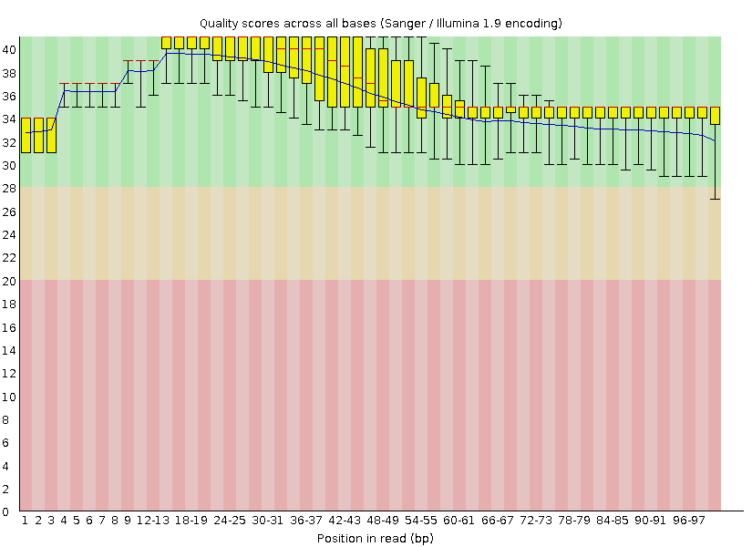

# Instructor

Manuel Alain Ramírez Sáenz

# Control de Calidad

En esta sección aprenderemos brevemente cómo realizar el Análisis de Calidad de las Secuencias, producto del secuenciamiento.

# 1. Términos empleados

## FASTQ

Línea 1: comienza con ‘@’ que contiene información sobre el nombre del secuenciador.

Línea 2: la secuencia de nucleótidos.

Línea 3: Una línea de encabezado o una línea que comience con solo '+'.

Línea 4: representa el puntaje de calidad.

  

 
* Existen muchos métodos diferentes para codificar los puntajes de calidad de nuestras secuencias. Como se puede ver en la siguiente imagen.

* Para reducir los requisitos de almacenamiento, las puntuaciones de calidad de FASTQ se almacenan como caracteres individuales y se convierten en números obteniendo la puntuación de calidad ASCII y restando 33 o 64.

* Por ejemplo, el archivo FASTQ de la imagen tiene el formato Sanger y el carácter '!' Tiene un ASCII valor de 33. Por lo tanto, la base correspondiente tendría un puntaje de calidad Phred de 33-33 = Q0 ( poco confiable). Por otro lado, una base con una puntuación de calidad indicada por "@" que tiene un valor ASCII de 64 tendría una puntuación de calidad Phred de 64-33 = Q31.


* Donde P es la probabilidad estimada de una base incorrecta. Por ejemplo, si Phred asigna un puntaje de calidad de 10 a una base, las posibilidades de una base incorrectamente son de 1 en 10.

```bash
@id
ATGC
+
05:I
```

Vamos a decodificar esos caracteres con la imagen anterior, obteniendo:

```bash
@id
ATGC
+
10 20 25 40
```
Luego la probabilidad P:

```bash
20 -> 10^(20/10) -> 10^-2 -> 1/100 -> 0.01 -> 1%
```

Obteniéndose:

```
@id
ATGC
+
10% 1% 0.3% 0.01%
```

## FASTA

Secuencia de nucleótidos basado en texto sin puntuación de calidad, que es solo la línea 1 y 2 de FASTQ, tiene un encabezado que comienza con “>” y la siguiente línea en la secuencia.


# 2. Control de calidad

La primera tarea que tenemos que hacer al recibir una data de secuenciamiento es evaluar su calidad. Para hacer esto usaremos el programa FastQC, la cual es una herramienta de control de calidad para datos NGS. 
FastQC es   util para resumir la calidad de la secuenciación y detección de problemas potenciales.

## 2.1. Instalación de FastQC
* El programa se puede descargar en http://www.bioinformatics.babraham.ac.uk/projects/fastqc/.
- Otra opción es utilizando el siguiente comando:

```bash
$ wget https://www.bioinformatics.babraham.ac.uk/projects/fastqc/fastqc_v0.11.9.zip
```

*NOTA: verificar la versión del zip, si es otro, modificar según sea necesario.*

* Una vez descargado el archivo zip, descomprimimos escribiendo:

```bash
$ unzip fastqc_v0.11.9.zip
```
  
* El folder generado tendrá el nombre de FastQC
  
```bash  
$ cd FastQC 
```
   
* Dentro de la carpeta FastQC, es útil mirar el archivo INSTALL.TXT para ver algunas instrucciones sobre la instalación y cómo utilizar el sorftware.

- Para hacer ejecutable el software se usará chmod de la siguiente manera:

```bash   
$ chmod 755 fastqc   
```
 
* Una vez realizado, se puede ejecutar directamente ejecutando: 
 
 ```bash  
 $ ./fastqc
 ```
  
* También puede colocar un enlace en /usr/local/bin para poder ejecutar el programa desde cualquier lugar.
  
```bash 
$ sudo ln -s  /home/manager/FastQC/fastqc  /usr/local/bin/fastqc   
```

* Ahora podemos utilizar el programa desde cualquier lugar, escribiendo:

```bash
$ fastqc
```


## 2.2. Cómo ejecutar los archivos
### 2.2.1. Ejecutar por medio de la interfaz gráfica

Cargar los archivos en la sección "file" de la siguiente gráfica


### 2.2.2. Ejecutar por medio de comandos Linux

```bash
$ ./fastqc good_seq.fastq bad_seq.fastq 
```

* En caso de haber copiado en /usr/local/bin, usar de la siguiente manera:

```bash
$ fastqc good_seq.fastq bad_seq.fastq 
```
## 2.3. Interpretación de los resultados
Antes de interpretar los resultados, tomar en consideración los siguientes símbolos: 


* Módulos de análisis incorporados en el programa FastQC.

## 2.3.1. Estadísticas básicas

Estadísticas generales y algunos antecedentes información sobre el archivo de entrada.
En este caso, tenemos una serie de errores y advertencias que a primera vista sugieren que ha habido un problema, pero no se preocupe demasiado todavía. Repasemos a su vez.


## 2.3.2. Calidad por base de la secuencia

* Mide los valores de calidad de las bases en todas las lecturas del archivo FASTQ de entrada. 
* Este estadistico muestra una descripción general del rango de valores de calidad en todas las bases (en cada posición).
* Generalmente, si presenta una puntuación de calidad media superior a Q20 se considera aceptable; todo lo que está por encima de Q30 se considera "bueno".

| BAD SEQUENCE | GOOD SEQUENCE  |
| ------------ | ------------- |
| En la siguiente imagen podemos observar una muestra que presenta problemas de calidad, calidad que disminuye al final de las lecturas. Es normal que la calidad de lectura empeore hacia el final de la lectura. | En esta otra imagen podemos observar una muestra que presenta una buena calidad, por encima de Q30 (recordar que una calidad por encima de Q20 es aceptable). |
|  |		|

## 2.3.3. Calidad de secuencia por mosaico

* Esta es una vista puramente teórica sobre la ejecución de secuenciación. La celda de flujo de secuenciación se divide en áreas llamadas celdas.
* El color de los mosaicos indica la calidad de la lectura.

| BAD SEQUENCE | GOOD SEQUENCE  |
| ------------ | ------------- |
| En la siguiente imagen poedemos observar que hay mosaicos de colores rojos, verdes, entre otros, lo cual indica una disminución de la calidad.  | Lo ideal es obtener una imagen completamente azul, que es indicativo de una buena calidad por secuencias. |
|  |	 |


## 2.3.4. Valores de calidad por secuencia

* Son valores de calidad promedio por secuencia para el archivo FASTQ de entrada.

| BAD SEQUENCE | GOOD SEQUENCE  |
| ------------ | ------------- |
|  Podemos observar un pico adicional con una Q diferente, pero aún así es considerado una buena muestra. | En el eje X podemos observar la calidad media de las secuencias secuencia. En general, la gráfica muestra un solo pico, lo cual indica que la mayoria de las secuencias tienen en promedio un Q30 superior. |
|  |	 |


## 2.3.5. Contenido de secuencia por base

* Porcentaje de A, C, G, T en las lecturas de FASTQ.
* Para una biblioteca generada de forma completamente aleatoria con un contenido de GC del 50%, se espera que en cualquier posición dada dentro de una lectura haya un 25% de posibilidades de encontrar una base A, C, T o G.

| BAD SEQUENCE | GOOD SEQUENCE  |
| ------------ | ------------- |
| la siguiente imagen representa una advertencia cuando la diferencia entre alguna de las bases es mayor al 10%, falla cuando esta diferencia alcance el 20% en cualquier posición. Incluso para un conjunto de datos de buena calidad, es posible que esta prueba no pase necesariamente. | Podemos observar que nuestra biblioteca cumple con los criterios mencionados anteriormente. En la mayoria de casos se suele observar un sesgo  menor al comienzo de la lectura (esto puede deberse a duplicados de PCR durante la amplificación o durante la preparación de la biblioteca. |
|  |  |


## 2.3.6. Contenido de GC por base 

* El contenido de GC en las lecturas de FASTQ, para cada posición de la base.

| BAD SEQUENCE | GOOD SEQUENCE  |
| ------------ | ------------- |
| En la siguiente una imagen podemos observar una advertencia de porcentaje de GC real sobrepasando al valor teórico. | Podemos observar dos curvas, la distribución de GC teórico representado de color azul y la distribución real de GC representado en rojo. Lo ideal es que ambas curvas sean similares, como podemos ver en la imagen. |
|  |  |

## 2.3.7. Contenido de N por base

* Porcentaje de bases N en cada posición en las lecturas FASTQ.


| BAD SEQUENCE | GOOD SEQUENCE  |
| ------------ | ------------- |
| La imagen resume el número de bases ambiguas, representadas como N en todas las lecturas sin procesar. Si el número de N es mayor al 5%, se emite una advertencia;  si es mayor al 20%, falla. | En la siguiente imagen, no se encuentra un porcentaje N en el conjunto de datos, por eso observamos una linea uniforme en el eje X. |
|  |  |

## 2.3.8. Distribución de la longitud de la secuencia

* Resumen de la distribución de la longitud de las lecturas FASTQ, útil después de recortar las lecturas.

| BAD SEQUENCE | GOOD SEQUENCE  |
| ------------ | ------------- |
| Podemos observar que las longitudes, en promedio tienes 40 bp, en un caso contrario observariamos quizás diferentes picos lo que representaría que en promedio las longitudes presentan diferentes tamaños. | De igual manera que el caso anterior, podemos observar un solo pico de longitud promedio de las lecturas. |
|  |  |

## 2.3.9. Niveles de duplicación de secuencia 

* Resumen de los recuentos de cada secuencia en el archivo FASTQ, útil para detectar problemas de enriquecimiento sesgado como la sobre amplificación por PCR.
* Este módulo cuenta el grado de duplicación de cada secuencia en el conjunto y crea un gráfico que muestra el número relativo de secuencias con diferentes grados de duplicación.

| BAD SEQUENCE | GOOD SEQUENCE  |
| ------------ | ------------- |
|  |  |
|  |  |

## 2.3.10. Secuencias sobrerrepresentadas

* Resumen de frecuencia de las secuencias, útil para detectar y clasificar contaminantes en la secuenciación, por ejemplo, cebadores de PCR.

| BAD SEQUENCE | GOOD SEQUENCE  |
| ------------ | ------------- |
| En este caso, ha encontrado muchas lecturas que parecen tener una frecuencia alta de las secuencias.  |  |
|  |  |

# 3. Herramientas de control de calidad

Las herramientas de control de calidad a menudo proporcionan más utilidad, algunas son suites completas de manipulación de secuencias. 


Actualmente recomendamos usar [fastp](https://github.com/OpenGene/fastp) para el control de calidad.

# 4. Recorte de calidad de lectura

El recorte de calidad de lectura es un proceso utilizado en la secuenciación de ADN para mejorar la precisión de los datos obtenidos. Históricamente, los primeros instrumentos de secuenciación tendían a producir datos menos fiables hacia el final de cada lectura. Para corregir esto, se aplicaba un método llamado "trimming", que consiste en eliminar las partes de la lectura que tienen baja calidad, comenzando desde el final y avanzando hacia el inicio, hasta alcanzar un nivel aceptable de precisión. Este proceso ayuda a asegurar que los datos utilizados en el análisis sean lo más precisos y fiables posible.


```bash
# Obtención de los datos crudos
fastq-dump --split-3 -X 10000 SRR1553607

# Instalación de fastp
conda install -c bioconda fastp
```

Control de calidad con [fastp](https://github.com/OpenGene/fastp):

```bash
# Single end
fastp --cut_tail -i SRR1553607_1.fastq -o SRR1553607_1.trim.fq

Detecting adapter sequence for read1...
No adapter detected for read1

Read1 before filtering:
total reads: 10000
total bases: 1010000
Q20 bases: 988715(97.8926%)
Q30 bases: 945783(93.6419%)

Read1 after filtering:
total reads: 9999
total bases: 996684
Q20 bases: 987731(99.1017%)
Q30 bases: 944988(94.8132%)

Filtering result:
reads passed filter: 9999
reads failed due to low quality: 0
reads failed due to too many N: 0
reads failed due to too short: 1
reads with adapter trimmed: 0
bases trimmed due to adapters: 0

Duplication rate (may be overestimated since this is SE data): 0%

JSON report: fastp.json
HTML report: fastp.html

fastp --cut_tail -i SRR1553607_1.fastq -o SRR1553607_1.trim.fq 
fastp v0.23.4, time used: 1 seconds
```

```
# Paired-end
fastp --cut_tail -i SRR1553607_1.fastq -I SRR1553607_2.fastq -o SRR1553607_1.trim.fq -O SRR1553607_2.trim.fq
Read1 before filtering:
total reads: 10000
total bases: 1010000
Q20 bases: 988715(97.8926%)
Q30 bases: 945783(93.6419%)

Read2 before filtering:
total reads: 10000
total bases: 1010000
Q20 bases: 946525(93.7153%)
Q30 bases: 883136(87.4392%)

Read1 after filtering:
total reads: 9847
total bases: 980112
Q20 bases: 971822(99.1542%)
Q30 bases: 931244(95.014%)

Read2 after filtering:
total reads: 9847
total bases: 954555
Q20 bases: 940415(98.5187%)
Q30 bases: 877922(91.9719%)

Filtering result:
reads passed filter: 19694
reads failed due to low quality: 166
reads failed due to too many N: 0
reads failed due to too short: 140
reads with adapter trimmed: 334
bases trimmed due to adapters: 6327

Duplication rate: 0%

Insert size peak (evaluated by paired-end reads): 101

JSON report: fastp.json
HTML report: fastp.html

fastp --cut_tail -i SRR1553607_1.fastq -I SRR1553607_2.fastq -o SRR1553607_1.trim.fq -O SRR1553607_2.trim.fq 
fastp v0.23.4, time used: 1 seconds
```

Control de calidad con [trimmomatic](https://www.usadellab.org/cms/?page=trimmomatic):

```bash
# Instalación con conda
conda install bioconda::trimmomatic

# Single end mode
trimmomatic SE SRR1553607_1.fastq  SRR1553607_1.trim.fq  SLIDINGWINDOW:4:30

TrimmomaticSE: Started with arguments:
 SRR1553607_1.fastq SRR1553607_1.trim.fq SLIDINGWINDOW:4:30
Automatically using 1 threads
Quality encoding detected as phred33
Input Reads: 10000 Surviving: 9737 (97.37%) Dropped: 263 (2.63%)
TrimmomaticSE: Completed successfully
```

```bash
# Paired-end mode
trimmomatic PE SRR1553607_1.fastq SRR1553607_2.fastq \
               SRR1553607_1.trim2.fq SRR1553607_1.unpaired.fq \
               SRR1553607_2.trim2.fq SRR1553607_2.unpaired.fq \
               SLIDINGWINDOW:4:30

TrimmomaticPE: Started with arguments:
 SRR1553607_1.fastq SRR1553607_2.fastq SRR1553607_1.trim2.fq SRR1553607_1.unpaired.fq SRR1553607_2.trim2.fq SRR1553607_2.unpaired.fq SLIDINGWINDOW:4:30
Quality encoding detected as phred33
Input Read Pairs: 10000 Both Surviving: 9156 (91.56%) Forward Only Surviving: 581 (5.81%) Reverse Only Surviving: 121 (1.21%) Dropped: 142 (1.42%)
TrimmomaticPE: Completed successfully
```

```bash
# Generar reporte de calidad con fastqc:
fastqc *.fastq *.fq
```

La gráfica resultante muestra el archivo original a la izquierda y la versión de calidad recortada a la derecha:




Puede notar que los resultados de la fastp el recorte no es idéntico a los resultados producidos mediante trimmomatic. Por defecto, fastp funciona de izquierda a derecha, mientras que trimmomatic trabaja de derecha a izquierda. Puedes sintonizar fastp para que coincida con el trimmomatic recorte pero no al revés.

Por ejemplo, el comportamiento de la acción `SLIDINGWINDOW:4:30` en trimmomatic es equivalente a `--cut_window_size 4 --cut_mean_quality 30 --cut_tail` en fastp.

# 5. Recorte del adaptador de secuenciación

## 5.1. ¿Qué son los adaptadores de secuenciación?
Durante la preparación de la biblioteca, se agregan adaptadores de ADN de diseño único de longitudes que generalmente tienen más de 30 bases 5' y 3' extremos de cada secuencia.

Por lo tanto, después de agregar los adaptadores, las secuencias monocatenarias que lo convierten en el instrumento serán de la forma:

```
XXXXAAAATTTTGGGGCCCCYYYY
```

donde `XXXX` y `YYYY` son los adaptadores de secuenciación.

## 5.2. ¿Cómo visualizo los adaptadores de secuenciación?

FastQC detectará adaptadores basados en secuencias de Illumina y los mostrará de la siguiente manera:


La línea ascendente indica el número de secuencias adaptadoras contenidas en esa base.

## 5.3. ¿Podemos personalizar la detección del adaptador?

Sí. FASTQC tiene archivos que especifican los adaptadores a buscar.

La ubicación del archivo adaptador depende de la instalación (y el número de versión), pero estaría en alguna parte como `~/miniconda3/envs/bioinfo/opt/fastqc-0.11.8/Configuration/adapter_list.txt`

El contenido predeterminado del archivo adaptador es:

```
Illumina Universal Adapter                              AGATCGGAAGAG
Illumina Small RNA 3' Adapter                           TGGAATTCTCGG
Illumina Small RNA 5' Adapter                           GATCGTCGGACT
Nextera Transposase Sequence                            CTGTCTCTTATA
SOLID Small RNA Adapter                                 CGCCTTGGCCGT
```

Agregar sus adaptadores a esa lista le permitirá mostrarlos en el gráfico FASTQC.

## 5.4. ¿Por qué necesitamos recortar adaptadores?

Como recordarán, dentro del instrumento de secuenciación, cada lectura tiene secuencias artificiales unidas a su fin. Si la secuencia es AAAAAAAAAAA y el adaptador es TTTTTT luego, dependiendo del tamaño de la biblioteca y la longitud de lectura, la secuenciación puede encontrarse con el adaptador.

```
AAAAAAAAAAATTTTTT
------>
---------->
--------------->
```

La última lectura tendrá la secuencia del adaptador TTTTT al final.

Si la superposición de bases en el adaptador es lo suficientemente larga (5-6), podemos detectar el propio adaptador y cortar la secuencia al inicio del adaptador.

## 5.5 ¿Cómo recortamos adaptadores?

Obtengamos un archivo SRA que sabemos que necesita alguna fijación:

```
# Obtención de lecturas que requieren recorte de adaptadores.
fastq-dump -X 10000 --split-files SRR519926

# Generate a FASTQC report
fastqc SRR519926_1.fastq
```

Algunas herramientas como fastp puede reconocer y recortar adaptadores automáticamente. Pero la detección automática solo funciona en algunas circunstancias. 

```bash
# Single-end mode.
fastp -i SRR519926_1.fastq -o SRR519926_1.trimmed.fq
```

Aquí procesamos solo un extremo de la preparación de la biblioteca de extremo emparejado para demostrar el proceso de detección automática del adaptador. La salida de fastp mostrará la secuencia del adaptador que se detectó:

```
Detecting adapter sequence for read1...
>Illumina TruSeq Adapter Read 1
AGATCGGAAGAGCACACGTCTGAACTCCAGTCA

Read1 before filtering:
total reads: 10000
total bases: 2510000
Q20 bases: 1705380(67.9434%)
Q30 bases: 1436342(57.2248%)

Read1 after filtering:
total reads: 8123
total bases: 1925252
Q20 bases: 1480733(76.9111%)
Q30 bases: 1264611(65.6855%)

Filtering result:
reads passed filter: 8123
reads failed due to low quality: 1854
reads failed due to too many N: 23
reads failed due to too short: 0
reads with adapter trimmed: 1266
bases trimmed due to adapters: 115763

Duplication rate (may be overestimated since this is SE data): 0%

JSON report: fastp.json
HTML report: fastp.html

fastp -i SRR519926_1.fastq -o SRR519926_1.trimmed.fq 
fastp v0.23.4, time used: 2 seconds
```

Tenga en cuenta cómo la herramienta detectó y eliminó automáticamente la secuencia del adaptador Illumina muy común. Confusamente, la misma detección automática no funcionaría si pasáramos ambas lecturas a la herramienta en modo de extremo emparejado. Por lo tanto, para los datos de extremo emparejado, tendremos que especificar la secuencia del adaptador manualmente. Podemos hacerlo de varias maneras, como una lista de secuencias explícita en la línea de comandos `--adapter_sequence AGATCGGAAGAGCACACGT` o como archivo FASTA `--adapter_fasta adapter.fa`:

Permite crear ese archivo adaptador para el instrumento Illumina:

```
echo ">illumina" > adapter.fa
echo "AGATCGGAAGAGCACACGTCTGAACTCCAGTCAC" >> adapter.fa

# Podemos ejecutar fastp en modo de extremo emparejado con un archivo adaptador especificado.
fastp --adapter_fasta adapter.fa -i SRR519926_1.fastq -I SRR519926_1.fastq \
        -o SRR519926_1.trim.fq -O SRR519926_2.trim.fq

# Podemos ejecutar fastp en modo de extremo emparejado con una secuencia de adaptador.
fastp --adapter_sequence AGATCGGAAGAGCACACGT -i SRR519926_1.fastq -I SRR519926_1.fastq \
        -o SRR519926_1.trim.fq -O SRR519926_2.trim.fq
```

Para recortar adaptadores con el trimmomatic herramienta que usaríamos:

```
# Trimmomatic operando en modo de un solo extremo.
trimmomatic SE SRR519926_1.fastq SRR519926_1.trim.fq ILLUMINACLIP:adapter.fa:2:30:5
```

## 5.5. ¿Cómo realizamos múltiples pasos a la vez?

La mayoría de las herramientas nos permiten realizar juntos múltiples acciones en un solo comando pasando múltiples acciones. La necesidad más común es recortar tanto la calidad como los adaptadores en modo de extremo emparejado. Los comandos se verían así:

```bash
# Recorte los adaptadores en el modo de extremo emparejado y recorte las bases de baja calidad de los extremos
fastp --cut_tail --adapter_sequence AGATCGGAAGAGCACACGT \
       -i SRR519926_1.fastq -o SRR519926_1.trim.fq \
       -I SRR519926_2.fastq -O SRR519926_2.trim.fq
```

La línea de comando resultante en trimmomatic es bastante ocular.

```
trimmomatic PE SRR519926_1.fastq SRR519926_2.fastq  \
               SRR519926_1.trim.fq SRR519926_1.unpaired.fq \
               SRR519926_2.trim.fq SRR519926_2.unpaired.fq \
               SLIDINGWINDOW:4:30 TRAILING:30 ILLUMINACLIP:adapter.fa:2:30:5
```

Hay una forma más corta de correr trimmomatic a través del -basein y -baseout parámetros que utilizan plantillas de nombres de lectura para reconocer archivos:

```bash
trimmomatic PE -basein SRR519926_1.fastq -baseout SRR519926.fq  \
               SLIDINGWINDOW:4:30 TRAILING:30 ILLUMINACLIP:adapter.fa:2:30:5
```

Generará archivos de salida como:

```
SRR519926_1P.fq
SRR519926_1U.fq
SRR519926_2P.fq
SRR519926_3U.fq
```
# 6. Duplicación de secuencias

## 6.2. ¿Qué es la duplicación de secuencias?
La duplicación usualmente se refiere a la presencia de secuencias idénticas en los datos. Dependiendo de la cobertura esperada, los duplicados pueden representar mediciones correctas o errores.

De entrada, la palabra "duplicado" puede ser engañosa; parece implicar que hay “dos” de algo. En realidad, significa “más de uno”. No es de extrañar que haya mucha confusión sobre lo que es la duplicación y, más importante aún, sobre cuál es la acción adecuada cuando se observa.

Los duplicados se dividen en dos categorías:

- **Duplicados naturales**: estos son fragmentos idénticos presentes en la muestra. No deben eliminarse.
- **Copias artificiales**: se producen artificialmente durante el proceso de secuenciación, la amplificación por PCR y errores de detección. Estas sí deben eliminarse.

Pero, ¿cómo podemos distinguir entre estos dos casos? Resulta que el proceso está lleno de desafíos.

## 6.3. ¿Cómo detectamos la duplicación de secuencias?
Existen dos enfoques principales:

1. **Identidad de secuencia**: en este enfoque se identifican y eliminan secuencias que son exactamente idénticas.
2. **Identidad de alineación**: en este se encuentran y eliminan secuencias que se alinean de la misma forma.

Aunque suene contraintuitivo, al filtrar por identidad de secuencia, corremos el riesgo de favorecer lecturas con errores. Esto se debe a que eliminamos lecturas idénticas, pero conservamos aquellas que debían ser iguales pero fueron medidas incorrectamente, lo cual podría enriquecer nuestros datos con mediciones incorrectas.

Por otro lado, la identidad basada en alineación solo es viable si se cuenta con un genoma de referencia con el cual alinear los datos.

Existe una nueva clase de métodos que detectan la composición de subsecuencias (llamadas k-mers) que pueden usarse para corregir errores.

### ¿Cuál es el principal problema con los duplicados?
El efecto adverso de la duplicación de lecturas se manifiesta principalmente durante la detección de variaciones. Este proceso asigna una puntuación de fiabilidad a cada variante basada en el número de veces que ha sido observada. Si una única lectura con una variante resulta estar duplicada artificialmente, corre el riesgo de producir un resultado aparentemente más confiable de lo que realmente es.

## 6.4. ¿Deberíamos eliminar los duplicados?
Para el llamado de SNPs y la detección de variaciones en el genoma, la respuesta suele ser sí. Para otros procesos, la respuesta a menudo es no.

Eliminar duplicados es una alteración significativa de los datos; antes de hacerlo, se debe contar con evidencia adicional de que ninguno de los duplicados es de origen natural.

Como siempre, se debe evaluar la gravedad del problema y si afecta el estudio, para decidir adecuadamente.

### ¿Qué significa el gráfico de duplicación de FastQC?
No es tan simple interpretar el reporte de duplicación de FastQC. Nos hemos encontrado con dificultades al hacerlo.

Primero, ese pequeño número resaltado en la parte superior es uno de los valores más importantes. Indica el porcentaje de datos que son distintos.

